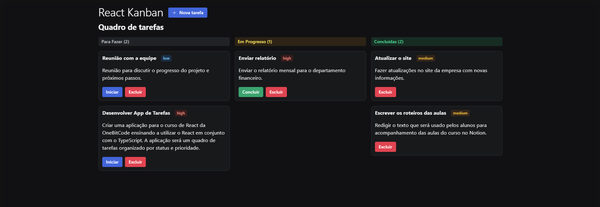

# React Kanban - Task Management App

Este é um aplicativo de gestão de tarefas em formato de quadro Kanban, desenvolvido com Vite, React, TypeScript, Radix UI e Zod. O app permite a criação, atualização, exclusão e organização de tarefas em diferentes status, com diferentes níveis de prioridade. O backend é simulado utilizando o json-server, oferecendo um CRUD completo de tarefas.




## Funcionalidades

- CRUD de Tarefas: Crie, edite, visualize e exclua tarefas.  
- Status das Tarefas: As tarefas podem ser organizadas em status como “A fazer”, “Em progresso” e “Concluído”.  
- Prioridade das Tarefas: Defina diferentes níveis de prioridade para as tarefas.  
- Kanban Board: Interface organizada em colunas que reflete o status das tarefas.  
- Simulação de Backend: Utilização do `json-server` para simular um backend RESTful.  
- Hooks React:  
  - `useState`: Gerenciamento de estados locais.  
  - `useEffect`: Efeitos colaterais para buscar e atualizar dados.  
  - `useContext`: Compartilhamento de estados globais entre componentes.

## Tecnologias Utilizadas

- **Vite**: Ferramenta de build rápida e leve para projetos em React.  
- **React**: Biblioteca JavaScript para construção de interfaces de usuário.  
- **TypeScript**: Superconjunto de JavaScript que adiciona tipagem estática.  
- **Radix UI**: Conjunto de componentes acessíveis e não opinativos para construção da interface.  
- **Zod**: Biblioteca para validação de esquemas e tipos.  
- **json-server**: Ferramenta que simula uma API REST completa com base em um arquivo JSON.

## Instalação e Execução

### Pré-requisitos

- Node.js (versão 14 ou superior)  
- npm ou yarn

### Passos para executar o projeto

1. Clone este repositório:

```bash
   git clone https://github.com/isaacpontes/react-kanban.git
````

2. Navegue até o diretório do projeto:

   ```bash
   cd react-kanban
   ```

3. Instale as dependências:

   ```bash
   npm install
   ```

   ou

   ```bash
   yarn install
   ```

4. Inicie o `json-server` para simular o backend:

   ```bash
   npm run json-server
   ```

5. Em outra aba do terminal, execute o projeto em modo de desenvolvimento:

   ```bash
   npm run dev
   ```

   ou

   ```bash
   yarn dev
   ```

6. Acesse a aplicação no navegador:

   ````
   http://localhost:5173
   ````

## Estrutura do Projeto

* `src/components`: Componentes reutilizáveis da aplicação.
* `src/entities`: Modelos de dados e interfaces.
* `src/hooks`: Hooks customizados.
* `src/contexts`: Contextos globais da aplicação.
* `src/services`: Funções para requisições HTTP ao `json-server`.
* `db.json`: Simula o banco de dados da API com as tarefas.

## Licença

Este projeto está licenciado sob a licença **MIT** – consulte o arquivo [LICENSE](https://github.com/yuri-moraes/kanban/blob/main/LICENSE) para mais detalhes
